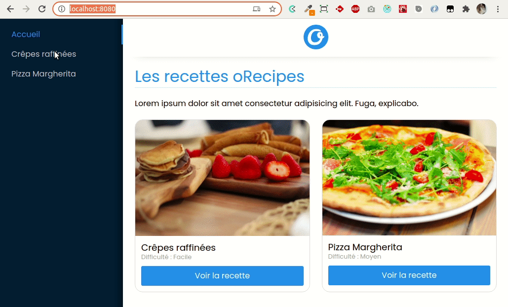

# oRecipes

Site de recette fait en React, Redux et React Router

Grâce à l'aide de Axios je reçois toutes les recettes via une API en local 

## Aperçus du site 

## Aperçus du site avec quelque animations

